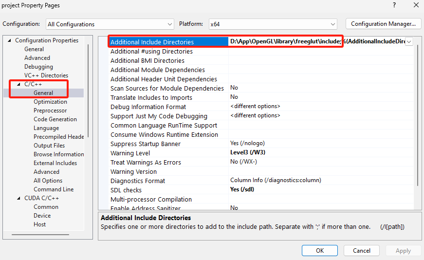

# 基于 GPU 的碰撞检测算法

马喆轩 2021080078 软12

## 1. 运行环境与依赖

### 开发环境
- Visual Studio 2022
- CUDA Toolkit 12.6
- OpenGL + FreeGLUT
- Windows 11 操作系统
- NVIDIA GTX 1660Ti 显卡（或其他支持CUDA的NVIDIA显卡）
- NVIDIA-SMI 561.17

### 项目依赖
- CUDA Runtime Library
- OpenGL Library
- FreeGLUT Library
- C++17 或更高版本

## 2. 模块逻辑关系

整个项目分为以下几个主要模块：

1. **渲染模块**
   - `main.cpp`: 程序入口，负责OpenGL初始化和场景渲染
   - `light.hpp`: 光照系统
   - `wall.hpp`: 墙体渲染，着色器管理

2. **物理模块**
   - `particle_system.hpp`: 小球系统管理
   - `ball.hpp`: 单个小球的属性和行为
   - `coor.hpp`: 3D向量运算

3. **CUDA加速模块**
   - `collusion.cu`: CUDA核心碰撞算法实现
   - `collusion.cuh`: CUDA接口定义

模块之间的关系：
- 渲染模块负责视觉呈现
- 物理模块处理粒子行为
- CUDA模块加速碰撞检测和处理

## 3. 功能演示方法

### 基本使用
1. 双击运行 `bin/program.exe` 程序
2. 使用命令行参数(在`bin`目录下)：
   ```bash
   ./program --ball 100
   ```

### 命令行参数
- `-b` 或 `--ball`: 设置球的数量（1-200）
- `-h` 或 `--help`: 显示帮助信息

### 示例

- 默认150球体，最大半径1

    直接双击program.exe 或
    ```bash
    ./program
    ```

- 使用200个球体
    ```bash
    ./program -b 200
    ```

演示视频在 `/docs/基于GPU的碰撞检测算法.mp4`

 
    小球一开始运动速度较大时，碰撞时会有一种“磕到”的感觉，运动了一会后，小球的运动速度会下降。


## 4. 程序运行主要流程

1. **程序初始化** (`main.cpp: SimulationApp::initialize`)
   - 解析命令行参数 (`parseArguments`)
   - 初始化CUDA设备 (`initializeGPU`)
   - 初始化OpenGL环境和窗口
   - 创建粒子系统 (`ParticleSystem` 构造函数)
   - 初始化场景边界 (`initializeWalls`)
   - 设置光照系统 (`Light::configure`)

2. **粒子系统初始化** (`particle_system.hpp: ParticleSystem::initialize`)
   - 为每个小球生成随机半径 (最大半径的50%~100%)
   - 使用碰撞检测找到合适的初始位置 (`checkOverlap`)
   - 生成随机初始速度
   - 设置粒子的材质和颜色属性

3. **主循环渲染** (`main.cpp: SimulationApp::displayCallback`)
   - 清除缓冲区
   - 设置相机视角 (`setupCamera`)
   - 渲染场景边界 (`renderEnvironment`)
   - 更新小球状态 (`ParticleSystem::update`)
   - 渲染粒子 (`ParticleSystem::render`)
   - 交换缓冲区

4. **物理更新流程** (`collision.cu: ProcessCollisions`)
   - 更新小球位置 (`CollisionPhysics::UpdateBallsStatus`)
     - 使用CUDA并行计算每个小球的新位置
     - 检查并处理边界碰撞 (`handleBoundaryCollision`)
   
   - 空间划分处理 (`SpatialHashing::SpatialSubdivision`)
     - 初始化空间网格 (`InitCells`)
     - 基数排序优化 (`RadixSortCells`)
     - 获取网格索引 (`GetCellIndices`)
     - 并行处理碰撞 (`HandleCollision`)

5. **碰撞检测与处理** (`collision.cu: CollisionPhysics`)
   - 检测碰撞 (`checkBallCollision`)
   - 计算碰撞响应 (`resolveBallCollision`)
     - 计算相对位置和速度
     - 应用冲量和弹性系数
     - 处理重叠问题

## 5. 性能测试与分析

### 测试环境
- CPU: Intel i7-10750H
- GPU: NVIDIA GTX 1660Ti (6GB GDDR6)
- 内存: 32GB
- 操作系统: Windows 11
- CUDA版本: 12.6

### 测试结果

1. **GPU加速效果**
   - 实测稳定30 FPS (200个粒子)
   - 帧率限制在显示器刷新率

2. **并行优化分析**
   - 空间划分算法：O(n²) → O(n)
   - CUDA并行优化：
     - `UpdateBallsStatus`: 每个线程处理一个粒子的位置更新
     - `InitCells`: 并行处理空间网格划分
     - `HandleCollision`: 多线程处理不同网格区域的碰撞
     - `RadixSortCells`: 并行基数排序优化

3. **关键性能优化点**
   - 空间划分：
     - 使用均匀网格划分
     - 每个粒子最多影响8个相邻网格
     - 减少碰撞检测的配对数量
   
   - CUDA优化：
     - 使用共享内存优化数据访问
     - 通过原子操作避免数据竞争
     - 动态计算线程块数量
     - 使用 `__syncthreads()` 确保线程同步

4. **内存优化**
   - 使用 `CellData` 结构体管理GPU内存
   - 批量处理数据传输
   - 优化内存对齐和访问模式

5. **性能瓶颈分析**
   - CPU-GPU数据传输开销
   - 空间划分的粒度选择
   - 线程块大小的影响
   - 显示同步限制（垂直同步）

## 7. 总结

对于第一次使用多线程，使用cuda的我来说这个大作业有点难度，特别是在于理解碰撞算法中如何变成并行来计算，这个是有点抽象的。最终的实现中可能会出现一点点穿模的情况。

## 8. 参考资料

1. NVIDIA CUDA 编程指南

    https://www.nvidia.cn/docs/IO/51635/NVIDIA_CUDA_Programming_Guide_1.1_chs.pdf

2. OpenGL 官网教程

    https://learnopengl.com/

3. 基于Cuda的碰撞检测算法 
    
    GPU Gems 3 - Chapter 32: Broad-Phase Collision Detection with CUDA

    https://developer.nvidia.com/gpugems/gpugems3/part-v-physics-simulation/chapter-32-broad-phase-collision-detection-cuda

4. 基于Cuda的并行前缀和算法

    GPU Gems 3 - Chapter 39. Parallel Prefix Sum (Scan) with CUDA

    https://www.opengl-tutorial.org/


## 9. 安装与配置过程

1. cuda安装相关
    只看上半部分就行了 二、cuDNN的部分不用理会
    https://blog.csdn.net/qq_40968179/article/details/128996692

    可以参考 https://zhuanlan.zhihu.com/p/488518526 中的3、CUDA 11.6的安装中的4). 检查是否安装成功部分，其他不用理会

2. 配置freeglut

    https://www.bilibili.com/video/BV1Kk4y1n7vo?spm_id_from=333.788.player.switch&vd_source=242881c2e0028b99f5965425eaeee832

3. 在2.创建的empty project引入cuda 这步很重要

    https://forums.developer.nvidia.com/t/adding-cuda-to-visual-studio-c-project-after-project-generation/245646

4. vs2022添加cuda相关配置

    https://wenku.csdn.net/answer/c0cab82bc4f445468d338afd3be63e8c

5. vs2022配置截图

    
    
    
    
    
    要把 freeglut.dll 拷贝到工作目录下！
    